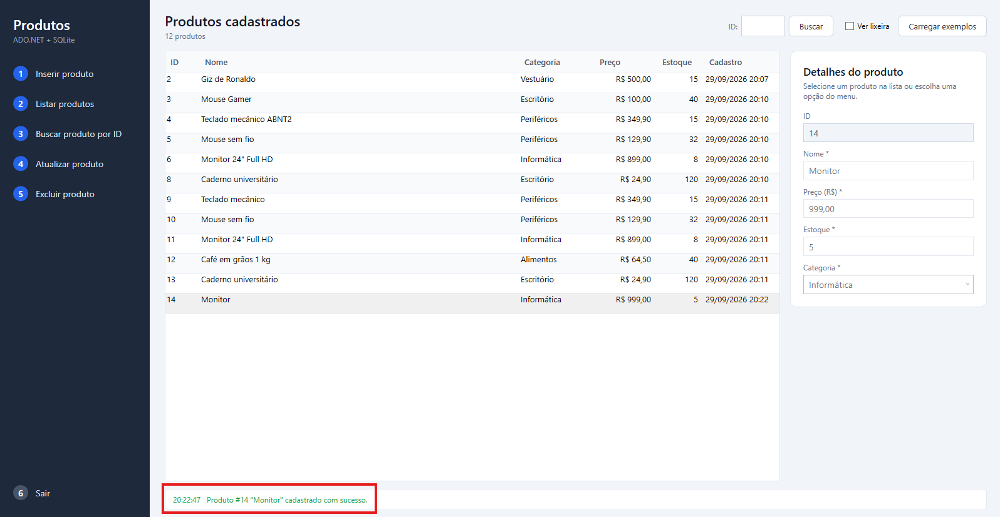
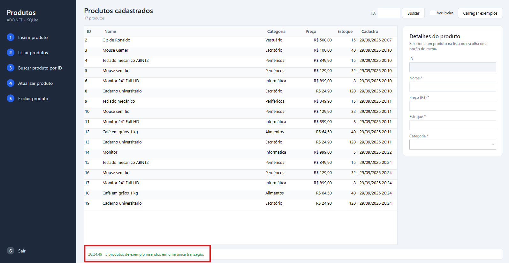
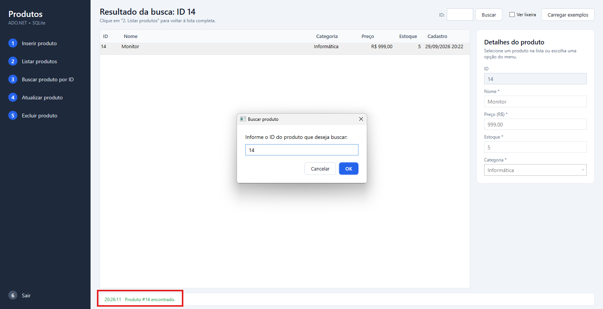
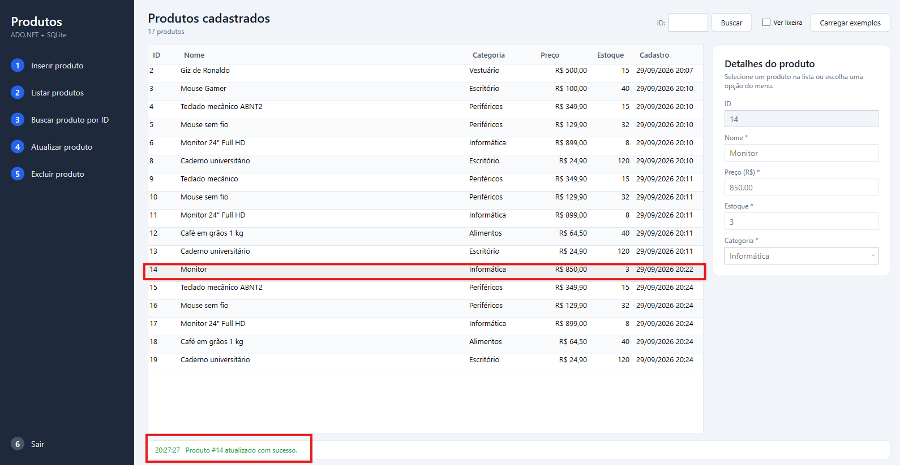
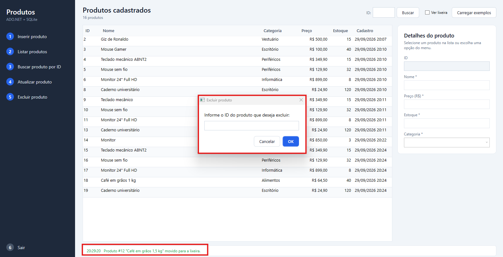
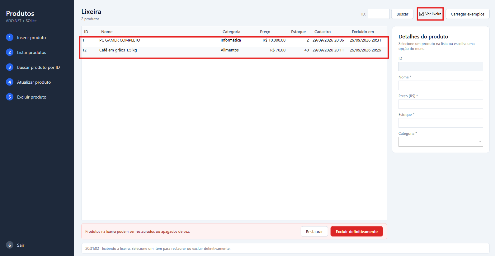

# Cadastro de Produtos — WPF + ADO.NET + SQLite

Aplicação desktop em **C# / WPF** para cadastrar e gerenciar produtos diversos.
O acesso ao banco é feito com **ADO.NET puro** (`SqliteConnection`, `SqliteCommand`, `SqliteDataReader`),
usando **comandos parametrizados** em todas as operações.

> **Autores:** Bruno Leão - RM555563 · Ruan Melo - 557599

---

## Funcionalidades

Menu lateral com as opções pedidas:

| Opção | O que faz | Método no repositório | Comando ADO.NET |
|---|---|---|---|
| **1. Inserir produto** | Abre o formulário vazio e grava o novo produto | `Inserir` | `ExecuteNonQuery` (INSERT, dentro de transação) |
| **2. Listar produtos** | Mostra todos os produtos ativos na grade | `Listar` | `ExecuteReader` (SELECT) |
| **3. Buscar produto por ID** | Localiza um produto pelo ID (campo no topo ou janela de ID) | `BuscarPorId` | `ExecuteReader` (SELECT) |
| **4. Atualizar produto** | Edita o produto selecionado (ou o ID informado) | `Atualizar` | `ExecuteNonQuery` (UPDATE) |
| **5. Excluir produto** | Move o produto para a lixeira (soft delete) | `Excluir` | `ExecuteNonQuery` (UPDATE) |
| **6. Sair** | Fecha a aplicação | — | — |

Extras (bônus):

- **Soft delete + lixeira:** a caixa *Ver lixeira* lista os excluídos (`ListarExcluidos`), permite **Restaurar** (`Restaurar`) ou **Excluir definitivamente** (`ExcluirDefinitivamente` → `DELETE` com `ExecuteNonQuery`).
- **Transações:** `Inserir` usa transação (INSERT + leitura do Id gerado) e o botão *Carregar exemplos* grava 5 produtos com `InserirVarios` em uma única transação — se um falhar, nenhum é gravado (rollback).
- **Testes unitários:** 30+ testes xUnit cobrindo CRUD, SQL Injection, transação, soft delete, tratamento de erros e log.

---

## Tecnologias

- .NET 8 (C# 12) — WPF
- SQLite via **Microsoft.Data.Sqlite** (provedor ADO.NET da Microsoft)
- Microsoft.Extensions.Configuration.Json (leitura do `appsettings.json`)
- xUnit (testes)

---

## Estrutura do projeto

```
ProdutosApp/
├── ProdutosApp.sln
├── database/
│   └── criar_tabela.sql            ← script de criação da tabela Produtos
├── src/
│   ├── ProdutosApp.Core/           ← regras e acesso a dados (não conhece a tela)
│   │   ├── Models/Produto.cs
│   │   ├── Data/IProdutoRepository.cs
│   │   ├── Data/ProdutoRepository.cs      ← todo o SQL fica aqui
│   │   ├── Data/InicializadorBanco.cs     ← executa o criar_tabela.sql
│   │   ├── Data/TradutorErrosSqlite.cs    ← códigos de erro → mensagens amigáveis
│   │   ├── Data/RepositoryException.cs
│   │   ├── Data/ProdutoInvalidoException.cs
│   │   └── Logging/ArquivoLogService.cs   ← log das operações em arquivo
│   └── ProdutosApp.Wpf/            ← interface gráfica (sem SQL)
│       ├── appsettings.json               ← connection string e caminho do log
│       ├── App.xaml(.cs)                  ← lê config, cria log/banco/repositório
│       ├── MainWindow.xaml(.cs)           ← menu, grade e formulário
│       └── InputIdWindow.xaml(.cs)        ← janela "Informe o ID"
├── tests/
│   └── ProdutosApp.Tests/          ← testes xUnit do repositório e do modelo
└── docs/
    ├── prints/                     ← capturas de tela das operações
    └── ROTEIRO_VIDEO.md            ← roteiro para a apresentação de 3–5 min
```

**Separação de camadas:** a janela (`MainWindow`) recebe um `IProdutoRepository` e só chama métodos como
`Inserir(produto)` ou `Listar()`. Nenhuma linha de SQL existe no projeto WPF.

---

## Pré-requisitos

- **Windows 10 ou 11** (WPF só executa no Windows)
- **.NET 8 SDK** ou mais novo — <https://dotnet.microsoft.com/download>
  (confira com `dotnet --list-sdks`)
- Opcional: **Visual Studio 2022** com a carga de trabalho *Desenvolvimento para desktop com .NET*

Não é preciso instalar nenhum servidor de banco: o SQLite é um arquivo, e o provedor já vem no pacote NuGet.

---

## Como configurar

A connection string fica em `src/ProdutosApp.Wpf/appsettings.json`:

```json
{
  "ConnectionStrings": {
    "ProdutosDb": "Data Source=produtos.db"
  },
  "Log": {
    "Arquivo": "logs/operacoes.log"
  }
}
```

- `Data Source=produtos.db` cria o banco **ao lado do executável** (`bin/Debug/net8.0-windows/produtos.db`).
  Pode ser trocado por um caminho completo, por exemplo `Data Source=C:\\dados\\produtos.db`.
- `Log:Arquivo` é o arquivo onde cada operação é registrada.

### Criação da tabela

O script [`database/criar_tabela.sql`](database/criar_tabela.sql) é **executado automaticamente** na abertura da aplicação.
Ele usa `CREATE TABLE IF NOT EXISTS`, então não apaga dados existentes.

Se quiser rodar manualmente:

- **sqlite3:** `sqlite3 produtos.db < database/criar_tabela.sql`
- **DB Browser for SQLite:** *Novo banco de dados* → aba *Executar SQL* → colar o script → executar.

---

## Como executar

### Pelo Visual Studio

1. Abra `ProdutosApp.sln`.
2. Clique com o botão direito em **ProdutosApp.Wpf** → *Definir como projeto de inicialização*.
3. Pressione **F5**.

### Pelo terminal

Na pasta raiz do repositório:

```bash
dotnet restore
dotnet run --project src/ProdutosApp.Wpf
```

### Testes

```bash
dotnet test
```

Os testes criam um banco SQLite temporário por teste, usando o mesmo `criar_tabela.sql`, e o apagam no final.

---

## Como usar

1. Clique em **Carregar exemplos** para ter dados rapidamente (ou use **1. Inserir produto**).
2. Selecione uma linha para ver os detalhes no painel da direita.
3. **4. Atualizar produto** (ou duplo clique na linha) edita o produto selecionado; sem seleção, a aplicação pede o ID.
4. **5. Excluir produto** pede confirmação e manda o produto para a lixeira.
5. Marque **Ver lixeira** para restaurar ou apagar definitivamente.
6. Digite um ID no campo do topo e pressione **Enter** para buscar.

Preço aceita `19,90`, `1.234,56`, `R$ 19,90` ou `19.90`.

---

## Prevenção contra SQL Injection

Nenhum valor digitado pelo usuário é concatenado no texto do SQL. Todos vão como parâmetros:

```csharp
const string sql = @"
    UPDATE Produtos
       SET Nome = @Nome, Preco = @Preco, Estoque = @Estoque, Categoria = @Categoria
     WHERE Id = @Id AND Ativo = 1;";

comando.CommandText = sql;
comando.Parameters.Add("@Nome", SqliteType.Text).Value = produto.Nome.Trim();
comando.Parameters.Add("@Preco", SqliteType.Real).Value = (double)produto.Preco;
comando.Parameters.Add("@Estoque", SqliteType.Integer).Value = produto.Estoque;
comando.Parameters.Add("@Categoria", SqliteType.Text).Value = produto.Categoria.Trim();
comando.Parameters.Add("@Id", SqliteType.Integer).Value = produto.Id;
comando.ExecuteNonQuery();
```

Teste prático: cadastre um produto com o nome `'); DROP TABLE Produtos; --`.
Ele é salvo como texto comum e a tabela continua intacta (há testes automatizados para isso).

---

## Tratamento de erros

| Situação | Onde é tratada | O que o usuário vê |
|---|---|---|
| Campo vazio, preço/estoque negativo, texto longo | `Produto.Validar()` → `ProdutoInvalidoException` (o banco nem é acessado) | Lista dos campos a corrigir |
| Violação de regra da tabela (`CHECK`, `NOT NULL`) | `SqliteException` código 19 → `RepositoryException` | "Os dados violam uma regra do banco…" |
| Arquivo do banco inacessível / caminho errado | `SqliteException` código 14 | "Não foi possível abrir o arquivo do banco…" |
| Banco bloqueado por outro programa | `SqliteException` códigos 5/6 | "O banco de dados está em uso…" |
| Tabela inexistente | `SqliteException` "no such table" | "A tabela Produtos não existe. Execute o script…" |
| ID inexistente | Retorno `null` / `false` do repositório | "Nenhum produto ativo foi encontrado com o ID X" |
| Qualquer erro inesperado | `DispatcherUnhandledException` no `App` | Mensagem de erro, sem fechar o programa |

Todos os erros de banco são registrados no log com o código original do SQLite.

---

## Log de operações

Cada operação gera uma linha em `logs/operacoes.log` (ao lado do executável):

```
2026-09-29 20:14:57.102 [INFO] APP | Aplicação iniciada
2026-09-29 20:14:57.180 [INFO] BANCO | Estrutura verificada em '...\produtos.db'
2026-09-29 20:15:02.418 [INFO] INSERIR | #6 'Mouse sem fio' | Categoria: Periféricos | Preço: R$ 129,90 | Estoque: 32
2026-09-29 20:15:02.430 [INFO] LISTAR | 6 produto(s) ativo(s)
2026-09-29 20:15:10.051 [INFO] BUSCAR | ID 6 encontrado: #6 'Mouse sem fio' | ...
2026-09-29 20:15:21.774 [INFO] ATUALIZAR | #6 'Mouse sem fio' | Categoria: Periféricos | Preço: R$ 119,90 | Estoque: 30
2026-09-29 20:15:30.905 [INFO] EXCLUIR | ID 6 movido para a lixeira (soft delete)
2026-09-29 20:16:44.312 [ERRO] FALHA ao listar produtos | código SQLite 14 | SqliteException: SQLite Error 14: 'unable to open database file'.
```

---

## Prints

| Inserir | Listar |
|---|---|
|  |  |

| Buscar por ID | Atualizar |
|---|---|
|  |  |

| Excluir | Lixeira |
|---|---|
|  |  |

---

## Modelo da tabela

| Coluna | Tipo | Regra |
|---|---|---|
| `Id` | INTEGER | Chave primária, autoincremento |
| `Nome` | TEXT | Obrigatório, 1 a 100 caracteres |
| `Preco` | REAL | Obrigatório, ≥ 0 |
| `Estoque` | INTEGER | Obrigatório, ≥ 0 |
| `Categoria` | TEXT | Obrigatória, 1 a 50 caracteres |
| `Ativo` | INTEGER | 1 = ativo, 0 = na lixeira (soft delete) |
| `DataCadastro` | TEXT | Preenchida automaticamente |
| `DataExclusao` | TEXT | Preenchida ao excluir, limpa ao restaurar |
